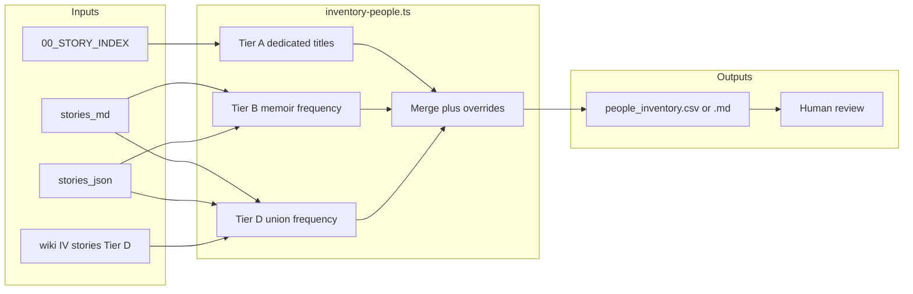

# People inventory from stories

## Context

- Architecture already expects [`content/wiki/people/`](content/wiki/people/) ([`docs/REQUIREMENTS.md`](docs/REQUIREMENTS.md)), but [`scripts/compile-wiki.ts`](scripts/compile-wiki.ts) only `mkdir`s `people` and never writes pages; [`content/wiki/index.md`](content/wiki/index.md) has no People section.
- Ask Keith preloads the full wiki index via [`getWikiSummaries()`](src/lib/ai/prompts.ts) — anything listed in `index.md` is high-signal for navigation.
- Memoir structured data lives in [`content/raw/stories_json/*.json`](content/raw/stories_json) (39 files, **no** `people` field today) and prose in [`content/raw/stories_md/*.md`](content/raw/stories_md). **Interview** episodes live as compiled markdown under [`content/wiki/stories/IV_*.md`](content/wiki/stories) (no raw `IV_*` under `stories_md`). **Tier D** is part of the default pipeline: the inventory script always ingests this interview corpus (ensure IV files are current by running the wiki / interview compile step before `inventory-people` when content changes).

## Suggested threshold (your criteria, made operational)

| Tier | Rule | Rationale |
|------|------|-----------|
| **A — Dedicated story** | Memoir `story_title` (from JSON or [`00_STORY_INDEX.md`](content/raw/upload_to_gpt/00_STORY_INDEX.md)) matches a **person-centric title** heuristic: proper-name-heavy title (e.g. contains a comma “Last, First” pattern, em-dash biography pattern, or matches a maintained **seed list** of obvious profile stories like `P1_S06`, `P1_S07`, `P1_S08`, `P1_S36`). | Captures “this chapter exists because of this person” without needing frequency. |
| **B — Repeat across memoir stories** | Normalized person label appears in **≥ 2 distinct `P1_S*` story_ids** when counting occurrences in combined text from `stories_md` + `stories_json` (all string values). | Surfaces recurring cast (family, key colleagues) even when no dedicated chapter exists. |
| **C — Manual overrides** | Small `include` / `exclude` list (YAML or JSON next to the script) for false positives (“United States”, firm names) and aliases (“Roger Ballou” vs “Roger”). | Keeps the first pass honest without perfect NER. |
| **D — Repeat across memoir + interviews** | Same candidate extraction and stoplists as Tier B, but each [`IV_S*.md`](content/wiki/stories) counts as its own **source id** alongside `P1_S*`. Flag when a name appears in **≥ 2 distinct sources in the union** of memoir + interview ids (e.g. one `P1_*` + one `IV_*` qualifies). Inventory table lists **memoir vs interview source ids separately** so reviewers can spot transcript noise. | Surfaces names reinforced in the interview layer who may not yet hit two memoir chapters, and highlights cross-cutting figures. |

**Explicit carve-out (recommended):** Treat [`P1_S30`](content/raw/stories_json/P1_S30.json) (famous cameos) as **out of scope for Tier B and Tier D frequency** unless a name also appears outside `P1_S30` — otherwise frequency rules will flood the list with one-off celebrities mentioned only there.

## Implementation approach

1. **Add** [`scripts/inventory-people.ts`](scripts/inventory-people.ts) (Node + `tsx`, same style as [`compile-wiki.ts`](scripts/compile-wiki.ts)):
   - Load all memoir story IDs from JSON directory; load all `IV_*.md` from [`content/wiki/stories/`](content/wiki/stories) (warn or exit non-zero if none found, depending on how strict you want CI).
   - **Tier A:** Classify titles from `story_title` / index `Title:` lines using conservative heuristics + optional `people_seed.json` keyed by `story_id` for edge cases (e.g. “A Remarkable Teacher’s Legacy” is dedicated to a person but not name-titled). Memoir-only; optional later: seed notable interviewer names if they should appear as people pages.
   - **Tier B:** Extract candidate **capitalized multi-word sequences** (2–4 tokens) from memoir markdown + JSON string dump; apply a **stoplist** (common false positives: United States, Peat Marwick, Boy Scouts, etc.); normalize whitespace; count **distinct `P1_S*` ids** per candidate; keep those with count ≥ 2; apply `P1_S30` carve-out for frequency-only hits.
   - **Tier D:** Run the **same extraction** on each `IV_*.md` body (strip YAML front matter if present). For each candidate, compute **union** of source ids (`P1_*` + `IV_*`) and flag when union size ≥ 2. Emit columns for `memoir_sources`, `interview_sources`, and `tiers_hit` (e.g. `B`, `D`, `B+D`, `A`).
   - **Merge** with overrides file (e.g. [`content/raw/people_inventory_overrides.json`](content/raw/people_inventory_overrides.json): `{ "include": [...], "exclude": [...], "aliases": { "Roger": "Roger Ballou" } }`).
   - **Write** a single review artifact: e.g. [`content/raw/people_inventory.md`](content/raw/people_inventory.md) (table: name, tiers, memoir story_ids, IV story_ids, notes) — human-readable and diff-friendly.

2. **Human review pass (manual step):** Approve/rename/drop rows; add missing family names Tier B missed.

3. **Follow-on (separate small change after list is stable):** Extend [`compile-wiki.ts`](scripts/compile-wiki.ts) to emit stub or rich [`content/wiki/people/*.md`](content/wiki/people) from the approved list and append a **## People** block to [`content/wiki/index.md`](content/wiki/index.md) so [`getWikiSummaries()`](src/lib/ai/prompts.ts) exposes people to Ask. Stub format can mirror story pages: title, one-sentence summary, “Appears in: [[stories/...]]” links — full prose can wait.

4. **Optional lint:** Add a check in [`scripts/lint-wiki.ts`](scripts/lint-wiki.ts) (if present) or a npm script that fails CI if `people_inventory.md` is stale vs sources (compare hashes / mtime) — only if you want enforcement.

## Scope boundaries

- **In scope:** Memoir + interview wiki markdown (Tier D) in one inventory pass, thresholds A–D, review artifact, clear path to wiki/Ask.
- **Out of scope for v1:** Full LLM-generated biography pages, automated alias resolution from web data, or Supabase-backed people tables (content stays file-based per existing architecture).

## Success criteria

- Checked-in inventory lists every **Tier A** dedicated-person story subject, **Tier B** memoir-only repeats, and **Tier D** union hits, each with evidence (`P1_*` and/or `IV_*` lists).
- Overrides file documents intentional exclusions (firms, generic phrases) so the next run is reproducible.
- After wiki hook-up: `index.md` lists people with `[[people/...]]` links consistent with existing wiki-link style.
