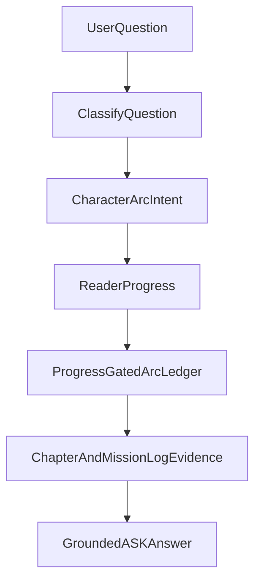

# ASK Answer Playbooks

**Purpose:** Map ASK question types to the best context sources so answers stay
grounded, spoiler-aware, and clear about the difference between canon,
interpretation, and speculation.

## Canon Precedence

When sources conflict, use the shared precedence from `src/lib/wiki/corpus.ts`:

1. `chapter_text`
2. `wiki_canon`
3. `derived_inference`

Character arc ledgers are `derived_inference`. They are useful for synthesis and
state-change explanations, but chapter text and reviewed wiki canon override
them.

## Question Type Matrix

| User asks... | Prefer context from... | Answer policy |
|---|---|---|
| Who/what is X? | Entity page, appearances, related entities | Give identity first; cite reviewed wiki or chapter anchor. |
| Why did X happen? | Scene beat, causal map, relevant rule, chapter text | Explain immediate cause before thematic meaning. |
| What does X mean? | Theme dossier, principle/rule, motif, parable, chapter text | Label interpretation and cite the scene that earns it. |
| How is X changing? | Character arc ledger first, relationship ledger second, chapter text third | Separate event summary from emotional/ethical state change. |
| Why did X behave that way? | Character arc ledger, relationship ledger, relevant scene | Tie motivation to pressure, choice/reaction, and consequence. |
| Is this a contradiction? | Chapter text, canon rank, continuity diff, source provenance | State source hierarchy and distinguish typo, ambiguity, and conflict. |
| What should I remember? | Progress summary, open threads, chapter recap, entity pages | Stay within reader progress and avoid late-book synthesis. |
| What mysteries remain? | Open thread ledger, progress summary, chapter recap | Say what is known, what is unknown, and when the question opened. |
| What might happen next? | Future questions, unresolved tensions, speculation guardrails | Use bounded possibilities; do not promote hypotheses into canon. |

## Character Arc Questions

Use `content/wiki/arcs/characters/*.md` when the user asks about:

- how a character changes
- why a character's behavior shifts
- what a choice reveals about the character
- whether a character is losing, gaining, or transforming a role
- what future questions remain for a character

### Retrieval Rules

- Prefer the named character's arc ledger if one exists.
- Include only chapter entries at or before the reader's current progress
  horizon unless reread mode is active.
- Pull chapter text or mission-log evidence for any major claim surfaced from a
  ledger.
- Use `Interpretive Claims` for book-supported readings.
- Use `Future Questions` and `Speculation Guardrails` only for explicitly
  speculative or future-facing prompts.
- If no ledger exists, fall back to the character page plus chapter appearances
  and say the arc ledger has not been authored yet if precision matters.

### Response Rules

- Do not answer an arc question with only plot recap.
- State the character's pressure/test, choice/reaction, consequence, and state
  after when the question asks for change.
- Mark ambiguity with phrases such as "the text supports," "as of CH##," or
  "the book has not answered that yet."
- Do not use generated dossier summaries as the sole evidence for scene-level
  claims.

## Implementation Notes

Current ASK context does not yet load `content/wiki/arcs/characters/` directly.
Future code wiring should use the existing prompt assembly path in
`src/lib/ai/perspectives.ts` and `src/lib/ai/prompts.ts`, with routing informed
by `src/lib/ai/router.ts`.

Suggested future hook:

## Evidence Panel Guidance

When arc ledgers are wired into ASK, the evidence panel should identify them as
derived artifacts and show the chapter or mission-log evidence that supports the
specific answer. A good source stack for a character-change answer is:

- Arc ledger section used.
- Chapter text or mission log cited by that section.
- Character page only for stable identity/background.
